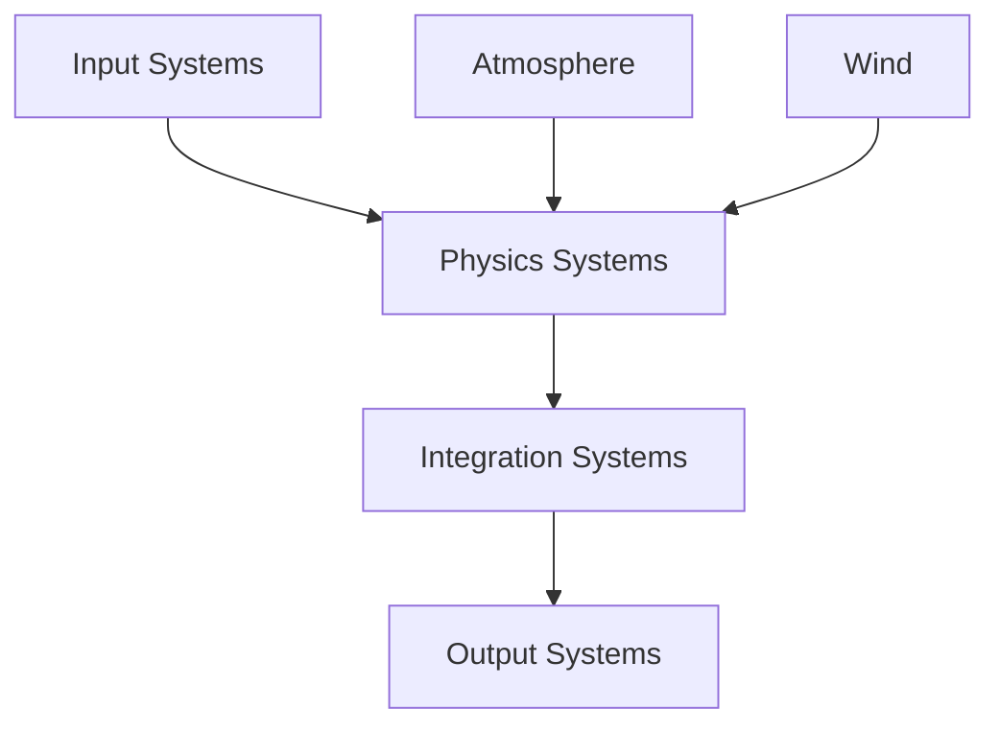

# Architecture

This document describes the architecture of the Buoy simulation engine.

## System Overview

Buoy is built on the Bevy ECS (Entity Component System) architecture, with several specialized modules for different aspects of the simulation.

## Core Components

### Entity Component System

The simulation uses Bevy's ECS for efficient entity management:

```rust
// Example entity with components
commands.spawn((
    BuoyantBody::new(1.0),
    Transform::default(),
    Velocity::default(),
));
```

### Physics Pipeline

1. **Force Calculation**
   - Buoyancy forces
   - Aerodynamic forces
   - Wind effects

2. **Integration**
   - Position updates
   - Velocity updates
   - Rotation updates

3. **Collision Detection**
   - Spatial partitioning
   - Contact resolution

## Module Structure

### buoy_core
- Core simulation systems
- Entity management
- Time management

### buoy_physics
- Physics calculations
- Force integration
- Collision handling

### buoy_aero
- Aerodynamic models
- Wind simulation
- Surface interactions

### buoy_atmo
- Atmosphere model
- Weather effects
- Environmental conditions

## Data Flow



## Performance Considerations

- Fixed timestep physics
- Parallel system execution
- Spatial partitioning for collisions
- Efficient memory management

## Extension Points

The architecture is designed to be extensible:

1. **New Physics Models**
   - Implement custom force calculations
   - Add new integration methods

2. **Custom Components**
   - Create new entity types
   - Add specialized behaviors

3. **External Systems**
   - Weather data integration
   - Hardware input/output
   - Network synchronization