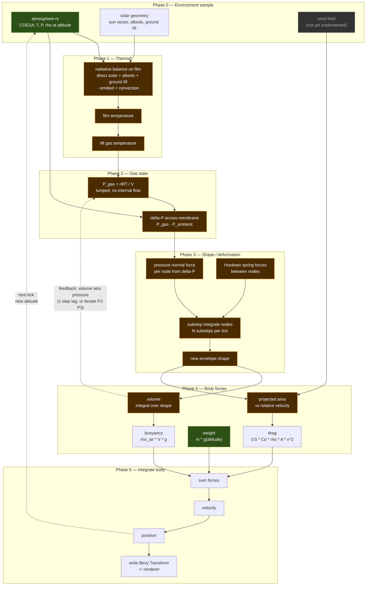

```mermaid
flowchart TD
    subgraph P0["Phase 0 — Environment sample"]
        ATM["atmosphere.rs<br/>COESA: T, P, rho at altitude"]
        SUN["solar geometry<br/>sun vector, albedo, ground IR"]
        WIND["wind field<br/>(not yet implemented)"]
    end

    subgraph P1["Phase 1 — Thermal"]
        RAD["radiative balance on film<br/>direct solar + albedo + ground IR<br/>- emitted + convection"]
        TFILM["film temperature"]
        TGAS["lift gas temperature"]
        RAD --> TFILM --> TGAS
    end

    subgraph P2["Phase 2 — Gas state"]
        GASLAW["P_gas = nRT / V<br/>lumped, no internal flow"]
        DP["delta-P across membrane<br/>P_gas - P_ambient"]
        GASLAW --> DP
    end

    subgraph P3["Phase 3 — Shape / deformation"]
        PUSH["pressure normal force<br/>per node from delta-P"]
        SPRING["Hookean spring forces<br/>between nodes"]
        SUBSTEP["substep integrate nodes<br/>N substeps per tick"]
        SHAPE["new envelope shape"]
        PUSH --> SUBSTEP
        SPRING --> SUBSTEP
        SUBSTEP --> SHAPE
    end

    subgraph P4["Phase 4 — Body forces"]
        VOL["volume<br/>integral over shape"]
        AREA["projected area<br/>vs relative velocity"]
        BUOY["buoyancy<br/>rho_air * V * g"]
        WEIGHT["weight<br/>m * g(altitude)"]
        DRAG["drag<br/>0.5 * Cd * rho * A * v^2"]
        VOL --> BUOY
        AREA --> DRAG
    end

    subgraph P5["Phase 5 — Integrate body"]
        NET["sum forces"]
        VEL["velocity"]
        POS["position"]
        XFORM["write Bevy Transform<br/>-> renderer"]
        NET --> VEL --> POS --> XFORM
    end

    ATM --> RAD
    SUN --> RAD
    ATM --> DP
    TGAS --> GASLAW
    DP --> PUSH
    SHAPE --> VOL
    SHAPE --> AREA
    WIND --> AREA
    BUOY --> NET
    WEIGHT --> NET
    DRAG --> NET
    POS -.->|"next tick:<br/>new altitude"| ATM

    VOL -.->|"feedback: volume sets pressure<br/>(1-step lag, or iterate P2-P3)"| GASLAW

    classDef keep fill:#2d5016,stroke:#7cb342,color:#fff
    classDef new fill:#4a2c00,stroke:#ff9800,color:#fff
    classDef later fill:#333,stroke:#777,color:#aaa

    class ATM,WEIGHT keep
    class RAD,TFILM,TGAS,GASLAW,DP,PUSH,SPRING,SUBSTEP,SHAPE,VOL,AREA new
    class WIND later
```
